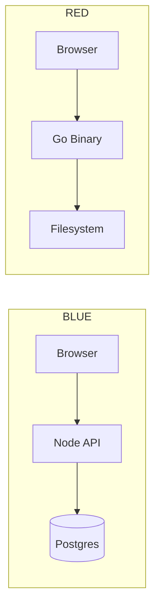

BLUE (Basic Linked Unified Exchange) was the predecessor to R.E.D. It used a PostgreSQL backend, a React frontend, and a Node.js API layer. Here is what went wrong and what we changed.

## What BLUE got wrong

### Database dependency

Every guide read required a round-trip to Postgres. A single misconfigured connection string took the whole node offline. With R.E.D., guides are flat files. No database means no connection failures, no migrations, and no ORM overhead.

### JavaScript build pipeline

The React frontend required Node, npm, webpack, and a build step on every deploy. The compiled bundle was 2.1 MB for a site that displayed text. R.E.D. ships zero client-side JavaScript except an optional Mermaid module loaded from CDN.

### No integrity verification

BLUE served content with no way for a reader to verify it had not been modified in transit or on disk. R.E.D. computes SHA-256 on the raw markdown bytes before rendering and exposes the hash both in the HTTP response header and the page metadata.

## What we kept

- Markdown as the authoring format
- Frontmatter for metadata
- The concept of named nodes with independent operation

## Architecture comparison

## Key takeaway

Complexity compounds. Every dependency you add is a surface area for failure. The best system is the one with the fewest moving parts that still does the job.
